# Integrated Optical → SAR Crop Type, Health & Yield Pipeline

<p align="center">
  <strong>Satellite-based crop classification, crop-relative health assessment, and yield-to-date estimation</strong><br>
  <em>Sokhda Village field study · Sentinel-2 optical time series + Capella X-band SAR</em>
</p>

---

## 1. What this project does

This notebook implements an end-to-end, two-stage geospatial ML pipeline that converts satellite observations of farm parcels into three field-level outputs:

1. **Crop type** — a phenology/template-derived crop label.
2. **Health score / health index (0–100)** — a **crop-relative** condition score.
3. **Yield estimate to date** — produced in the SAR stage from the blended health/area model.

The key design decision is deliberate:

> **Classify the crop first, then assess health against comparable fields growing the same crop.**

That prevents a healthy-looking cotton field from being directly compared with a rice field whose spectral behavior is naturally different.

### Project at a glance

| Stage | Input | Main processing | Output |
|---|---|---|---|
| **Stage 1 — Optical** | Sentinel-2 multispectral time series | Phenology → PCA → KMeans → Hungarian matching → peer-relative health scoring | Crop label + optical health score |
| **Stage 2 — SAR** | Capella X-band SAR SLC scenes | SNAP preprocessing → field features + GLCM texture → XGBoost crop/health models → blend | Predicted crop + health index + confidence + yield-to-date |

---

## 2. Results from the notebook

The executed notebook processed **966 fields**.

### Optical stage

- **966** total fields
- **956** classified fields
- **99.0%** crop-label coverage
- **10** fields remained Unknown / low-confidence
- **0** fields were marked `INSUFFICIENT_PEERS`
- Mean observations per field: **8.4**

Optical crop distribution:

| Crop | Fields |
|---|---:|
| Bajra | 220 |
| Rice | 218 |
| Cotton | 197 |
| Groundnut | 181 |
| Maize | 140 |

### SAR stage

The SAR stage produced predictions for **966 fields** and exported the final CSV, GeoPackage, crop/health/yield GeoTIFFs, legends, and diagnostic plots.

The predicted SAR crop distribution was:

| Crop | Predicted fields | Share |
|---|---:|---:|
| Bajra | 222 | 22.98% |
| Groundnut | 209 | 21.64% |
| Rice | 189 | 19.57% |
| Cotton | 182 | 18.84% |
| Maize | 164 | 16.98% |

> **Important:** the notebook explicitly describes the crop labels as phenology/template-derived pseudo-labels rather than ground-truth labels. The health score is a relative field-condition index, **not a disease diagnosis**.

---

## 3. Pipeline architecture

Instead of one large flowchart, the workflow is split into three readable diagrams: the overall pipeline, the optical stage, and the SAR stage.

### 3.1 End-to-end view

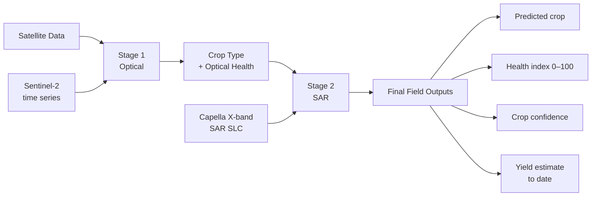
```mermaid
flowchart LR
    A["Satellite Data"] --> B["Stage 1<br/>Optical"]
    B --> C["Crop Type<br/>+ Optical Health"]
    C --> D["Stage 2<br/>SAR"]
    D --> E["Final Field Outputs"]

    A1["Sentinel-2<br/>time series"] --> B
    A2["Capella X-band<br/>SAR SLC"] --> D

    E --> E1["Predicted crop"]
    E --> E2["Health index 0–100"]
    E --> E3["Crop confidence"]
    E --> E4["Yield estimate<br/>to date"]
```

### 3.2 Stage 1 — Optical workflow

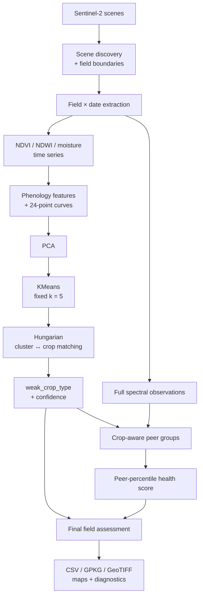
```mermaid
flowchart TD
    S["Sentinel-2 scenes"] --> X["Scene discovery<br/>+ field boundaries"]
    X --> T["Field × date extraction"]
    T --> T1["NDVI / NDWI / moisture<br/>time series"]
    T --> T2["Full spectral observations"]

    T1 --> P["Phenology features<br/>+ 24-point curves"]
    P --> PCA["PCA"]
    PCA --> KM["KMeans<br/>fixed k = 5"]
    KM --> H["Hungarian<br/>cluster ↔ crop matching"]
    H --> CL["weak_crop_type<br/>+ confidence"]

    CL --> PG["Crop-aware peer groups"]
    T2 --> PG
    PG --> HS["Peer-percentile health score"]

    CL --> F["Final field assessment"]
    HS --> F

    F --> O["CSV / GPKG / GeoTIFF<br/>maps + diagnostics"]
```

### 3.3 Stage 2 — SAR workflow

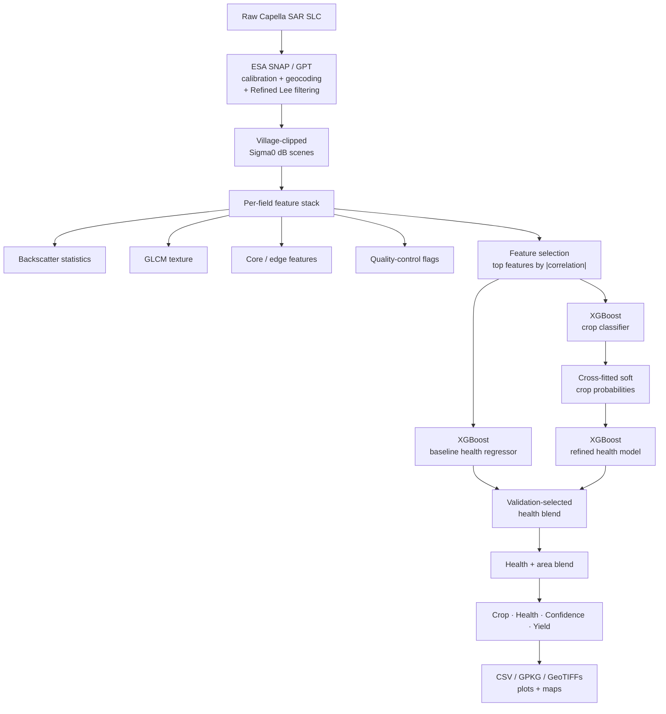
```mermaid
flowchart TD
    S["Raw Capella SAR SLC"] --> SNAP["ESA SNAP / GPT<br/>calibration + geocoding<br/>+ Refined Lee filtering"]
    SNAP --> V["Village-clipped<br/>Sigma0 dB scenes"]

    V --> FE["Per-field feature stack"]
    FE --> F1["Backscatter statistics"]
    FE --> F2["GLCM texture"]
    FE --> F3["Core / edge features"]
    FE --> QC["Quality-control flags"]

    FE --> FS["Feature selection<br/>top features by |correlation|"]
    FS --> C["XGBoost<br/>crop classifier"]
    FS --> H0["XGBoost<br/>baseline health regressor"]

    C --> CP["Cross-fitted soft<br/>crop probabilities"]
    CP --> H1["XGBoost<br/>refined health model"]

    H0 --> BL["Validation-selected<br/>health blend"]
    H1 --> BL
    BL --> Y["Health + area blend"]
    Y --> OUT["Crop · Health · Confidence · Yield"]

    OUT --> R["CSV / GPKG / GeoTIFFs<br/>plots + maps"]
```

---

## 4. Why the workflow is structured this way

### Crop classification comes before health scoring

Health is evaluated **within crop-aware peer groups**, using the following fallback order:

1. Same crop + same phenology stage
2. Same crop
3. Same phenology stage
4. `INSUFFICIENT_PEERS`

The notebook's health score combines crop-relative percentile measures for:

| Component | Weight |
|---|---:|
| Vigor | 40% |
| Chlorophyll | 30% |
| Moisture | 20% |
| Temporal trend | 10% |

This means a health score of 80 does **not** mean "80% healthy". It means the field is performing relatively well compared with its relevant peer group.

---

# 5. Stage 1 — Optical analysis

## 5.1 Crop classification diagnostics

The optical stage converts Sentinel-2 time series into phenological signatures, reduces them using PCA, clusters them with fixed **k = 5**, and maps the resulting clusters to the five target crop templates with Hungarian matching.

### Cluster ↔ crop template matching

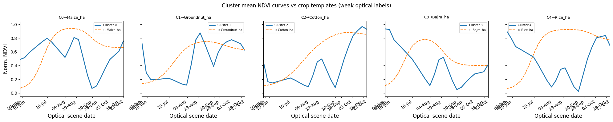

This plot is useful for understanding **why** each cluster receives a crop label: the cluster phenology is compared against the predefined crop templates rather than relying on a manually labeled training set.

### Classification confidence diagnostics

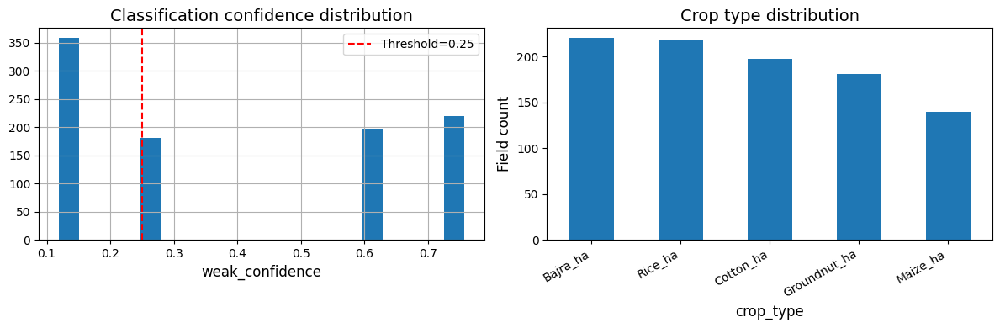

The notebook retains low-confidence labels instead of silently discarding them. This makes uncertainty visible and auditable.

---

## 5.2 Spatial crop classification

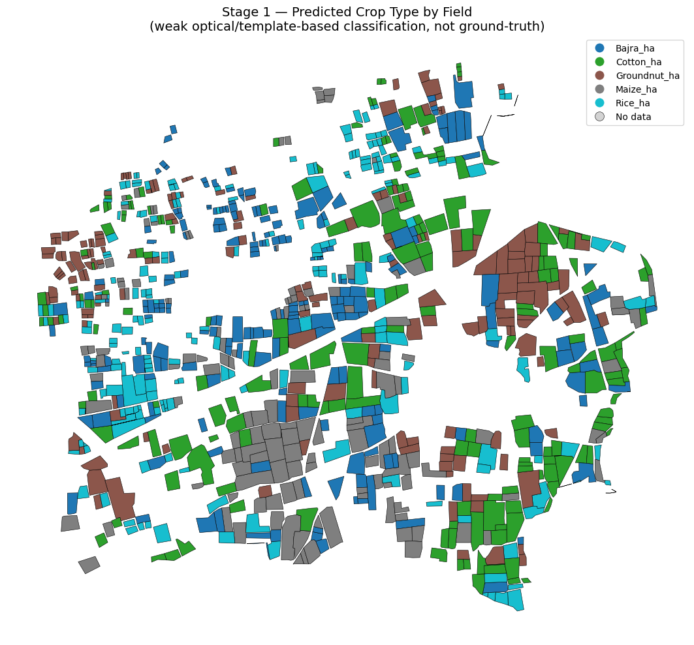

This map is the easiest way to read the optical result spatially: every field is assigned a crop label, allowing the distribution of the five target crops to be inspected directly across the study area.

---

# 6. Stage 1 — Optical health assessment

## 6.1 Health score across fields

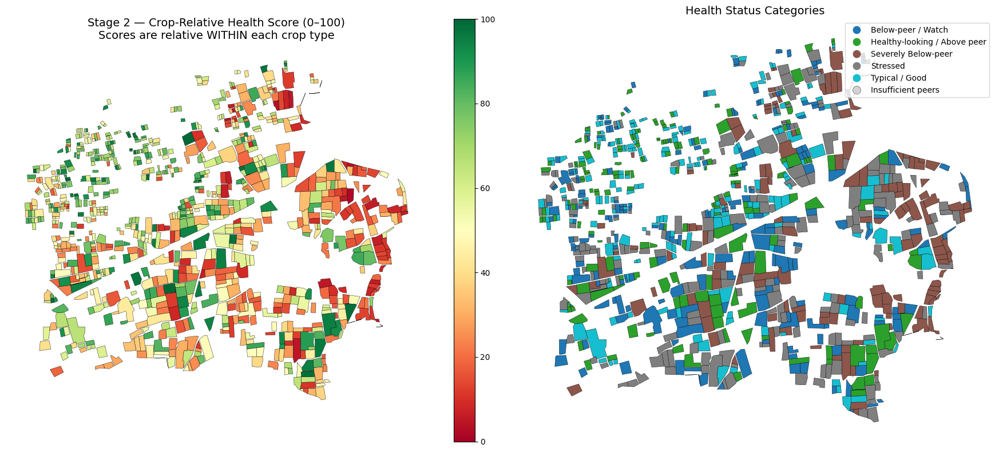

The left panel shows the **crop-relative health score (0–100)** and the right panel groups fields into health-status categories. The score is explicitly relative to comparable crop peers.

## 6.2 Health distribution by crop

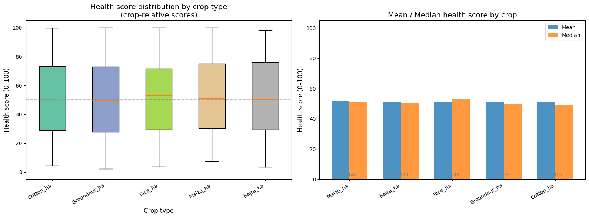

This view shows how the field-level health distributions differ by crop. Because the score is crop-relative, the comparison is primarily useful for identifying the spread and within-crop variation rather than treating one crop as inherently "healthier" than another.

## 6.3 Health-status composition by crop

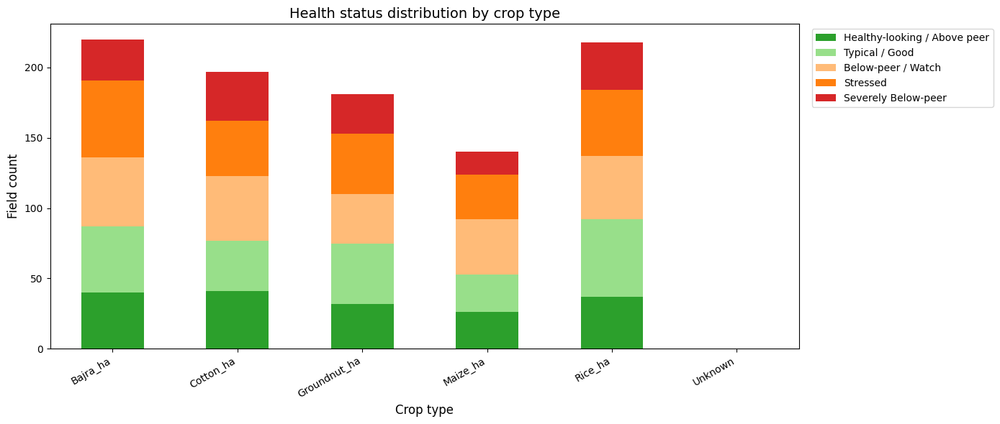

The status breakdown makes the health output easier to communicate: fields are grouped into categories such as **Severely Below-peer**, **Stressed**, **Below-peer / Watch**, **Typical / Good**, and **Healthy-looking / Above peer**.

## 6.4 Confidence distributions

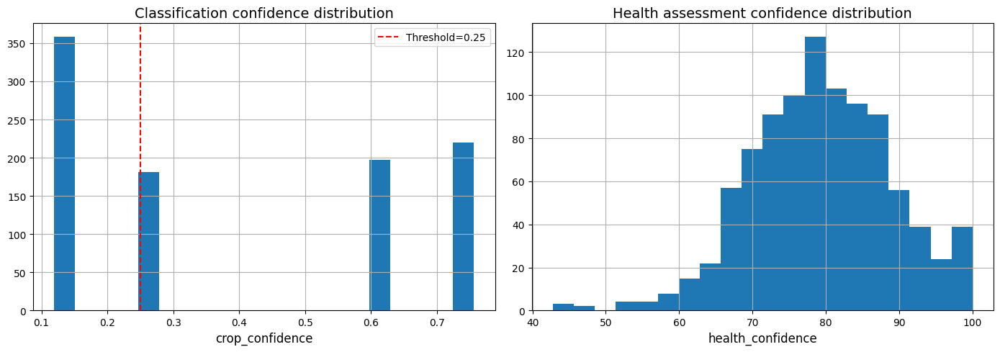

This plot separates **classification confidence** from **health-assessment confidence**, making uncertainty easier to interpret alongside the actual field scores.

## 6.5 Example field time series

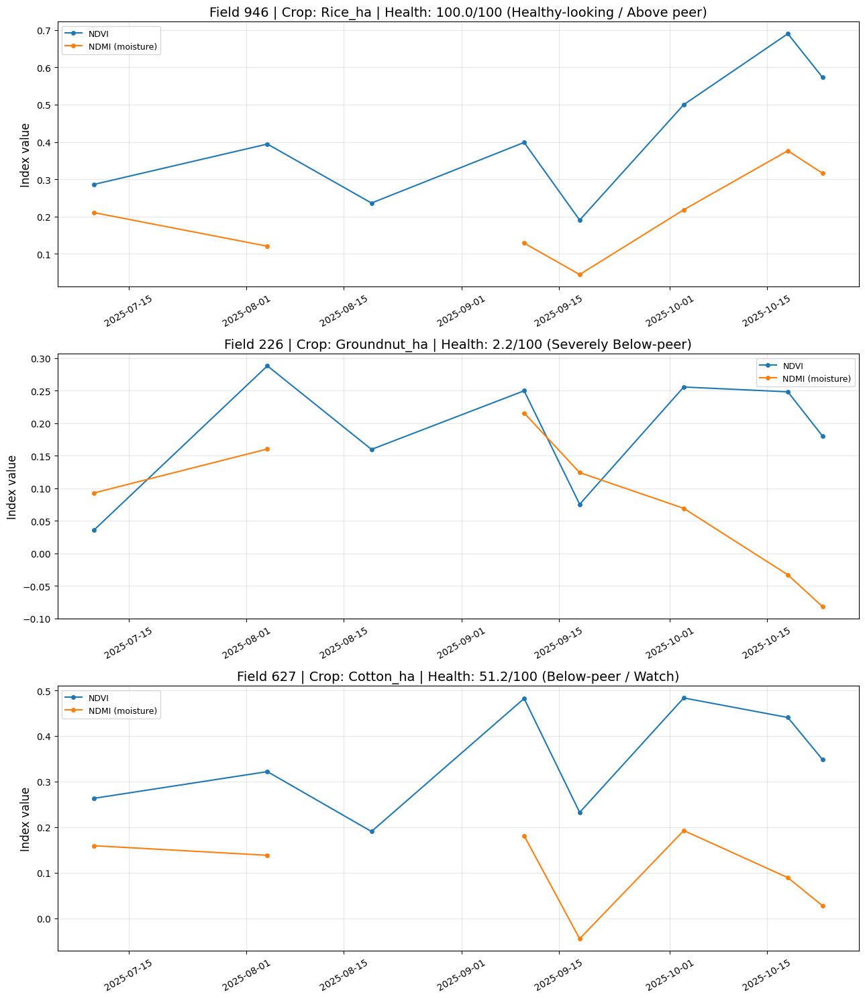

The time-series view connects the final field result back to the underlying vegetation trajectory. It is especially useful when reviewing an individual field rather than only looking at the aggregate maps.

## 6.6 Health component contribution

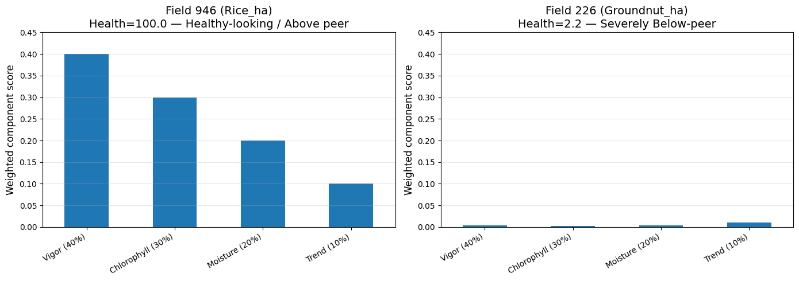

This diagnostic shows how the component scores contribute to the final crop-relative health assessment, helping explain why a field received a high or low score.

---

# 7. Stage 2 — SAR modelling

The SAR stage uses ESA SNAP to turn raw SLC scenes into calibrated, geocoded and speckle-filtered **Sigma0 dB** rasters. Per-field features then combine:

- backscatter statistics
- GLCM texture
- core-vs-edge field features
- quality-control indicators

The model layer uses two XGBoost paths:

- **SAR → crop classifier**
- **SAR → health regressor**

The refined health model receives **soft crop probabilities and uncertainty features**, rather than the hard crop label. This is important for avoiding crop-target leakage.

---

## 7.1 SAR crop predictions

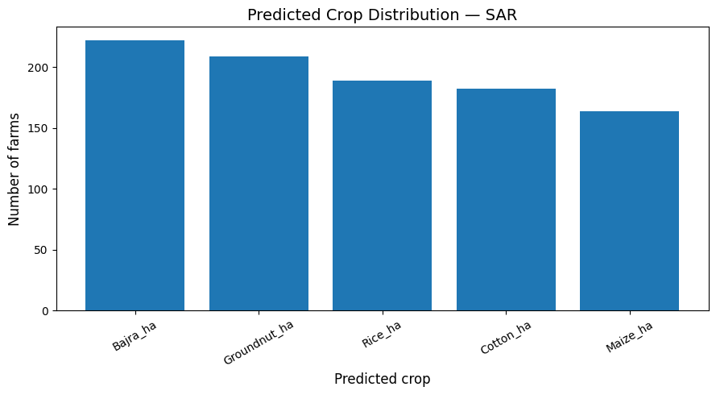

The final SAR predictions remain close to the five-crop structure defined by the notebook while allowing the classifier to produce field-level probabilities.

## 7.2 Crop confidence

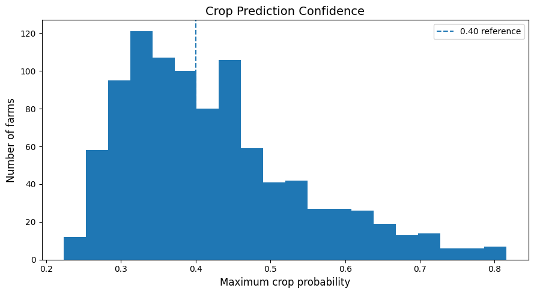

Confidence is represented by the maximum predicted crop probability. This makes low-confidence classifications distinguishable from confident predictions.

---

# 8. SAR health and yield results

## 8.1 Predicted health distribution

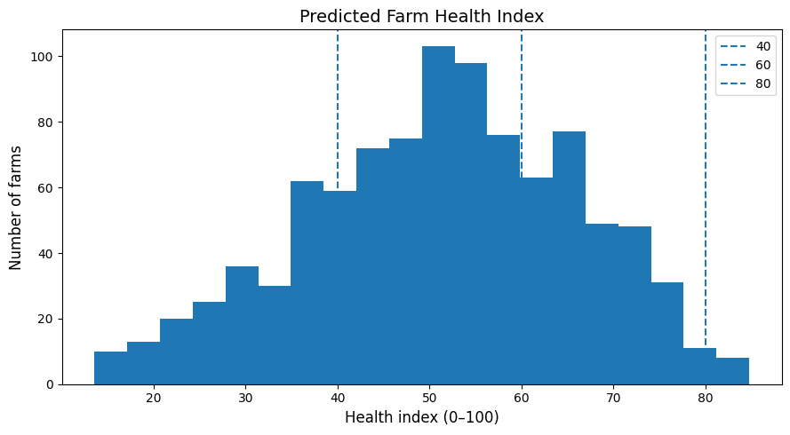

The health index is kept on the same **0–100** interpretation used by the final pipeline.

## 8.2 Health by predicted crop

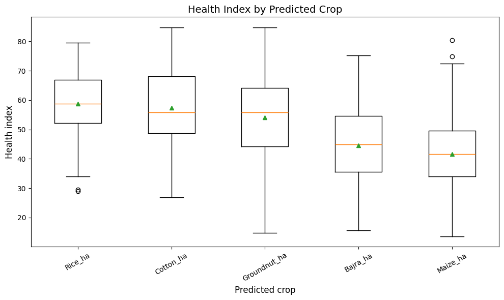

The executed notebook reported the following mean health indices:

| Predicted crop | Fields | Mean health |
|---|---:|---:|
| Rice | 189 | 58.70 |
| Cotton | 182 | 57.43 |
| Groundnut | 209 | 54.12 |
| Bajra | 222 | 44.49 |
| Maize | 164 | 41.54 |

These are **descriptive outputs of the model**, not evidence that one crop is biologically healthier than another.

## 8.3 Health vs yield-to-date

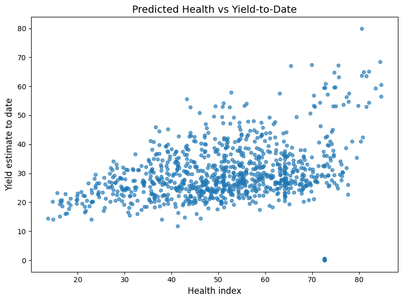

This plot shows the relationship produced by the final SAR pipeline between the predicted health index and **yield-to-date estimate**.

The yield output is explicitly a **to-date estimate**, not a final end-of-season production forecast.

---

# 9. Model diagnostics

## 9.1 Crop confusion matrix

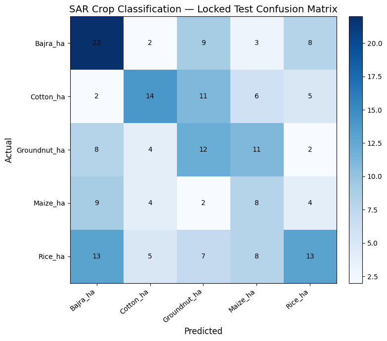

This locked-test confusion matrix provides a direct view of where crop classifications agree or disagree with the optical pseudo-label target used by the SAR classifier.

## 9.2 Health: actual vs predicted

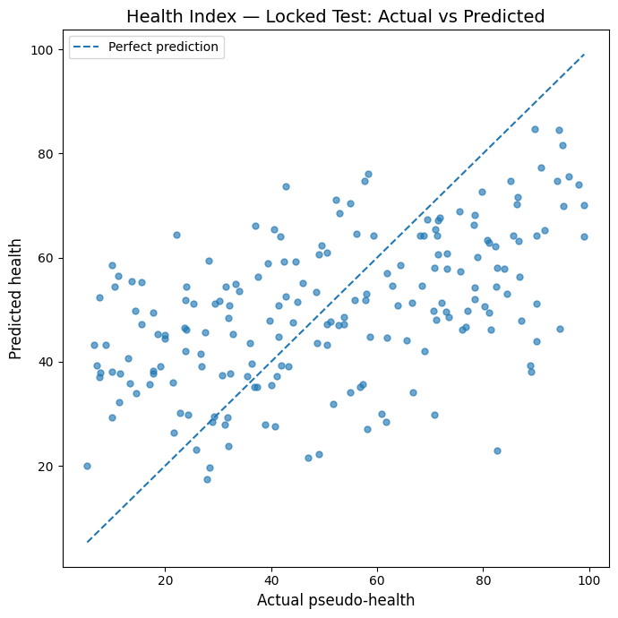

The actual-vs-predicted plot compares the SAR health estimate against the held-out pseudo-health target used for model validation.

> Because the health target is itself derived from the optical stage, these diagnostics should be interpreted as **agreement with the pipeline's pseudo-label target**, not as independent ground-truth agronomic validation.

---

# 10. Spatial SAR outputs

## Predicted SAR health map

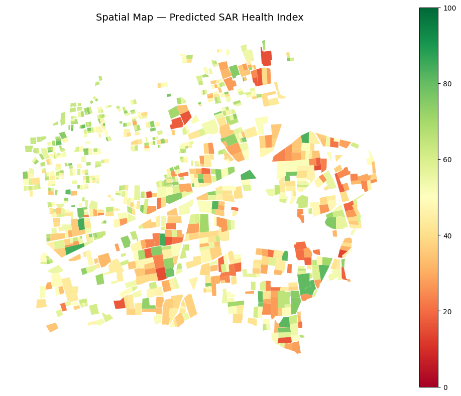

This map makes the final health index spatially interpretable at field level.

## Predicted SAR crop map

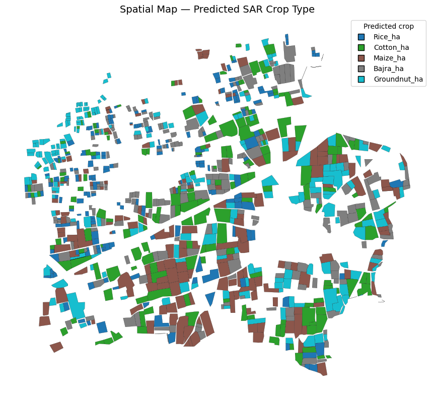

The crop map provides the spatial counterpart to the SAR crop-distribution chart.

## GeoTIFF health preview

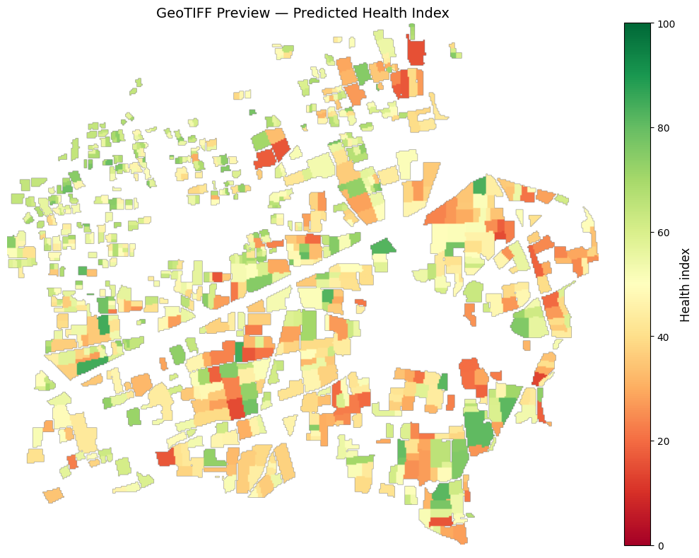

The notebook also writes GIS-ready GeoTIFF products, making the results usable outside the notebook in GIS workflows.

---

# 11. Input data

| Input | Format | Role |
|---|---|---|
| `Farm_boundaries_shp*.zip` | Zipped Shapefile | Field boundaries |
| `Village_Shp*.zip` | Zipped Shapefile | Village boundary / clipping |
| `Optical_TimeSeries.zip` | Sentinel-2 scene archive | Optical time series |
| Capella X-band SAR SLC scenes | GeoTIFF / scene folders | SAR modelling |
| `SLC_To_GeoCoded.xml` | ESA SNAP GPT graph | SAR preprocessing |
| Optical outputs | CSV / in-memory tables | Crop and health pseudo-label handoff to SAR |

---

# 12. Important configuration

The notebook uses a fixed five-crop template set:

```python
TARGET_CROPS = [
    "Rice_ha",
    "Cotton_ha",
    "Maize_ha",
    "Bajra_ha",
    "Groundnut_ha",
]
```

Other key settings include:

- Classification confidence threshold: **0.25**
- Savitzky–Golay window: **5**
- Savitzky–Golay polynomial order: **2**
- PCA explained-variance target: **0.90**
- Production KMeans: **k = 5**
- Health blend: **40% vigor + 30% chlorophyll + 20% moisture + 10% trend**
- SAR feature selection: top features ranked by absolute correlation with the health pseudo-label
- SAR health/yield blend: **0.70 health + 0.30 area**

---

# 13. Outputs

## Optical outputs

`Sokhda_Merged_Pipeline_Output/`

- final field assessment CSV
- GeoPackage
- crop classification GeoTIFF
- health score GeoTIFF
- crop legend
- health/status maps
- diagnostic plots
- `round1_farms.csv`
- `Health_Score.csv`

## SAR outputs

`SAR_Crop_Health_Outputs/`

- `final_sar_crop_health_yield.csv`
- `final_sar_crop_health_yield.gpkg`
- `model_test_metrics.csv`
- `predicted_crop_summary.csv`
- `health_summary_by_crop.csv`
- `predicted_crop_type.tif`
- `predicted_health_index.tif`
- `crop_confidence.tif`
- `yield_estimate_to_date.tif`
- `sar_crop_health_yield_stack.tif`
- diagnostic plots under `plots/`

### Combined 4-band GeoTIFF

| Band | Meaning |
|---|---|
| **1** | Predicted crop code |
| **2** | Health index |
| **3** | Crop confidence |
| **4** | Yield estimate to date |

---

# 14. Notebook structure

The notebook is organised as:

1. Imports and configuration
2. Data download
3. Shared helper functions
4. Farm boundary loading
5. Sentinel-2 scene discovery
6. Combined field/date extraction
7. Crop classification
8. Classification diagnostics
9. Crop-aware peer-group construction
10. Health scoring
11. Final field assessment
12. Validation
13. Maps and visualization
14. Export
15. Final optical summary
16. SAR preprocessing, modelling, diagnostics and export

Run the notebook **top to bottom** because the SAR stage consumes outputs created by the optical stage.

---

# 15. Technologies used

### Geospatial

`geopandas` · `shapely` · `rasterio` · GDAL · ESA SNAP

### Scientific computing

`numpy` · `pandas` · `scipy` · `scikit-learn`

### Machine learning

`XGBoost` · `joblib`

### Visualization

`matplotlib` · `IPython.display`

### Environment

Kaggle-style notebook environment with `/kaggle/input` and `/kaggle/working` path conventions.

---

# 16. How to run

1. Open the notebook in the intended Kaggle/local environment.
2. Ensure the farm and village boundary archives are available.
3. Run all cells **top to bottom**.
4. Allow time for ESA SNAP installation and SAR preprocessing.
5. Tune `MAX_WORKERS`, `GPT_RAM_PER_WORKER`, and `GPT_CACHE_SIZE` if the execution environment has different CPU/RAM limits.
6. Collect final products from:
   - `Sokhda_Merged_Pipeline_Output/`
   - `SAR_Crop_Health_Outputs/`

---

# 17. Caveats and interpretation

- **Crop labels are not verified ground truth.** They are derived from phenology/template matching in Stage 1.
- **Health is a relative condition index.** It compares a field with comparable crop/phenology peers rather than measuring an absolute physiological quantity.
- **Health is not disease diagnosis.**
- Fields without sufficient peer coverage are designed to be left unscored as `INSUFFICIENT_PEERS` rather than receiving an unreliable number.
- SAR health validation uses the optical health score as a pseudo-label, so independent field observations would still be needed for agronomic validation.
- Yield is a **to-date estimate**, not a final seasonal yield forecast.

---

## 18. Repository-friendly visual summary

The most important visual story is:

**Satellite time series → crop identification → crop-aware health benchmarking → SAR refinement → field-level crop + health + yield outputs**

That sequence is intentionally reflected throughout this README so that a reader can understand the pipeline before diving into implementation details.
