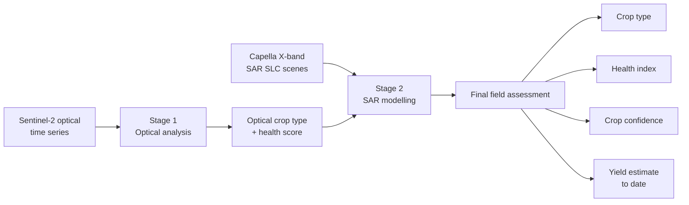
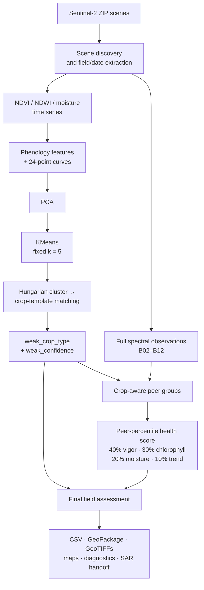
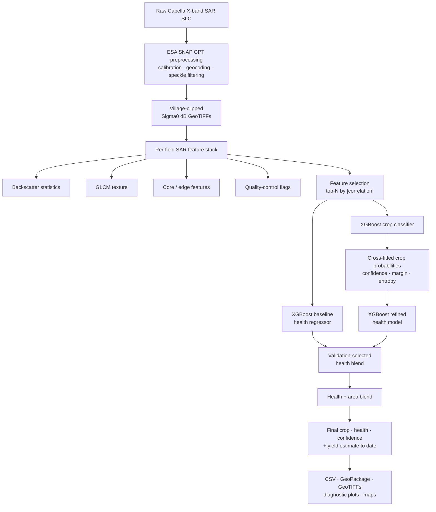

# Integrated Optical → SAR Crop Type, Health & Yield Pipeline

**Notebook:** `optical-sar_Fin_V2_Health_Type.ipynb`
**Domain:** Satellite remote sensing / precision agriculture (Sokhda Village field study)

## 1. Purpose & Overall Objective

This notebook is an end-to-end, two-stage geospatial ML pipeline that turns raw satellite
imagery of a set of farm parcels ("fields") into a **per-field crop type label, a
crop-relative health score, and a yield estimate**.

It is organized as **two chained stages that run inside one kernel**:

| Stage | Sensor | Produces |
|---|---|---|
| **1 — Optical** (Sections 1–15) | Sentinel-2 multispectral time series | `crop_type` (weak/template label) + an optical `health_score` per field |
| **2 — SAR** (Section 16 + SAR cells) | Capella X-band SAR (SLC) scenes | Model-predicted `crop_type`, `health_index`, and `yield_estimate`, blended with the optical outputs |

The guiding design principle stated throughout the notebook is:
**crop classification must always happen before health scoring**, because health is only
meaningful when compared against fields growing the *same* crop (a stressed rice field
should not be benchmarked against a healthy cotton field). The notebook enforces this with
explicit runtime checks (e.g. Section 11, Section 12A).

> **Important framing note (from the notebook's own documentation):** the outputs are a
> *satellite-derived relative condition index*, **not a disease diagnosis**, and the crop
> labels (`weak_crop_type`) are phenology/template-derived, not ground-truth.

---

## 2. High-Level Workflow Diagram

The original notebook flow is easier to follow when it is split into the **overall pipeline**, **optical stage**, and **SAR stage** instead of one large diagram.

### 2.1 End-to-end pipeline

### 2.2 Stage 1 — Optical

### 2.3 Stage 2 — SAR

> **Design principle:** crop classification happens before crop-relative health scoring. In the SAR stage, the health model uses **soft crop probabilities** rather than the hard crop label, helping avoid crop-target leakage.

---

## 3. Notebook Structure (Section Map)

The optical stage is organized into 15 numbered sections, followed by the SAR pipeline
(Section 16 + its supporting cells):

1. **Imports and Configuration** — libraries, paths, global constants (`TARGET_CROPS`,
   thresholds, peer-group minimums).
2. **Data Download** — pulls the `Optical_TimeSeries` dataset via `gdown` if not already present.
3. **Shared Helper Functions** — I/O, cloud-masking, spectral index math, phenology and
   classification helpers reused by both stages.
4. **Farm Boundary Loading** — reads the farm/village shapefiles from ZIP archives.
5. **Sentinel-2 Scene Discovery** — indexes all available `Browser_images_*.zip` scenes and
   their spectral bands into an `assets` lookup table.
6. **Combined Field-Level Time-Series Extraction** — the single extraction loop that reads
   each Sentinel-2 ZIP **once** and produces both `ts` (NDVI/NDWI/moisture) and
   `field_obs_df` (full spectral indices), used respectively by classification and health.
7. **Crop Classification** — phenology feature engineering → PCA → fixed-k=5 KMeans →
   Hungarian cluster-to-crop-template matching → `weak_crop_type`/`weak_confidence`.
8. **Classification Validation and Diagnostics** — crop distribution checks, cluster-vs-template
   curve plots, confidence-threshold diagnostics.
9. **Crop-Aware Health Assessment Setup** — merges `crop_type` into the health workflow and
   derives `phenology_stage` and crop-aware `peer_group` per field.
10. **Health Scoring** — peer-percentile scoring across vigor (40%), chlorophyll (30%),
    moisture (20%), and temporal trend (10%).
11. **Final Field Assessment** — assembles `final_field_assessment`, verifying that
    classification strictly precedes health scoring.
12. **Validation and Diagnostics** — range checks (health in [0,100], indices in [-1.05,1.05]),
    duplicate-ID checks, coverage/insufficient-peer statistics.
13. **Maps and Visualization** — crop classification map, health score/status maps, per-field
    component breakdown plots.
14. **Export** — writes CSV, GeoPackage, per-field GeoTIFFs (crop type, health), and legends.
15. **Final Summary** — prints pipeline-wide statistics (classified vs. unknown, scored vs.
    insufficient-peer counts, per-crop health averages).
16. **SAR Pipeline** — SNAP-based SAR preprocessing, per-field SAR feature extraction, SAR→crop
    and SAR→health XGBoost models, blended health/yield estimation, and a mirrored
    export/reporting section (maps, GeoTIFFs, confusion matrix, plots).

---

## 4. Inputs

### 4.1 Data sources

| Input | Format | Source / how it's obtained | Consumed in |
|---|---|---|---|
| `Farm_boundaries_shp*.zip` | Shapefile (zipped) | Local file / competition dataset; discovered by recursive glob under `BASE_DIR` | Section 4 |
| `Village_Shp*.zip` | Shapefile (zipped) | Same as above | Section 4 |
| `Optical_TimeSeries.zip` (contains `Browser_images_*.zip`) | Sentinel-2 scene ZIPs (bands B02–B12 + SCL, or pre-derived NDVI/NDWI GeoTIFFs) | Downloaded via `gdown 19YM5bgaJjGDcHMkDsD6AkncXlh0Fb3Hn` if not already present | Section 2, 5, 6 |
| SAR SLC scenes (Capella X-band) | `.tif` / scene folders under a Kaggle competition dataset path (`.../anrf-aise-hack-2-0-round-2-sar-crop-health-yield-estimation`) | Provided competition input; one scene (`CAPELLA_C14_SM_SLC_HH_20250619021410_...`) is explicitly excluded (`SKIP_SCENE`) | SAR preprocessing cells |
| ESA SNAP + GPT graph (`SLC_To_GeoCoded.xml`) | Software + XML processing graph | Installed via shell (`esa-snap_sentinel_linux-13.0.0.sh`); graph downloaded via `gdown 1MnENQjRnB24eVClxrQd91p92qqN6nnV3` | SAR preprocessing |
| Optical-stage outputs (`round1_farms.csv`, `Health_Score.csv`, or in-kernel `optical_crop_output` / `optical_health_output`) | CSV / in-memory DataFrame | Produced internally by Stage 1 (Section 12A hand-off) | SAR crop-label and health pseudo-label training |

### 4.2 Required parameters / configuration (Section 1)

Key global constants set at the top of the notebook and used throughout:

- `TARGET_CROPS = ["Rice_ha", "Cotton_ha", "Maize_ha", "Bajra_ha", "Groundnut_ha"]` — the
  fixed 5-crop template set (drives the `k=5` KMeans classification).
- `CLASSIFICATION_CONFIDENCE_THRESHOLD = 0.25` — labels below this are flagged low-confidence
  (label is retained, not discarded).
- `SMOOTH_WINDOW = 5`, `SMOOTH_POLYORDER = 2` — Savitzky–Golay smoothing of NDVI/NDWI curves.
- `PCA_VARIANCE_TARGET = 0.90` — cumulative explained-variance target for PCA component count.
- `MIN_CLUSTER_SIZE = 5`, peer-group minimums (`MIN_CROP_PHENOLOGY_PEERS`, etc.) used by the
  crop-aware peer grouping logic (priority: same crop + stage ≥10 → same crop ≥10 → same
  stage ≥15 → `INSUFFICIENT_PEERS`).
- `MIN_VALID_DATES` — computed adaptively from the number of usable Sentinel-2 scenes.
- SAR-side constants: `GLCM_LEVELS`, `GLCM_DB_MIN/MAX`, `MIN_PIXELS_FOR_TEXTURE`,
  `CORE_SHRINK_FRACTION`, and QC thresholds (`QC_LOW_COVERAGE_FRACTION`,
  `QC_MIN_FIELD_AREA_M2`, `QC_EDGE_CONTAM_DB`, `QC_NOISY_CV`, `QC_OUTLIER_Z`).
- XGBoost hyperparameters for the SAR crop classifier and health regressor (`max_depth`,
  `learning_rate`, `reg_lambda`, `early_stopping_rounds`, etc.), plus a `health_weight` /
  `area_weight` blend ratio (0.70 / 0.30) used when combining health and yield objectives.

The notebook is designed to run inside a **Kaggle-style environment**: paths default to
`/kaggle/working` and `/kaggle/input`, with automatic fallback to the current working
directory and its parents if those don't exist.

---

## 5. Outputs

### 5.1 Optical stage (`Sokhda_Merged_Pipeline_Output/`)

| File | Content |
|---|---|
| Final CSV (`final_field_assessment` minus geometry) | One row per field: `crop_type`, `crop_confidence`, `health_score`, `health_status`, spectral indices, peer-group, trend/anomaly features |
| GeoPackage (`.gpkg`) | Same table with field geometries, for GIS use |
| Crop classification GeoTIFF + `crop_code_legend.csv` | Rasterized crop-type map with a class-code lookup table |
| Health score GeoTIFF | Rasterized 0–100 crop-relative health raster |
| `map_crop_classification.png`, health maps, component/status plots | Diagnostic and presentation visuals |
| `round1_farms.csv`, `Health_Score.csv` (SAR hand-off) | Minimal `farm_id, crop_type` and `farm_id, health_index` tables consumed by Stage 2 |

### 5.2 SAR stage (`SAR_Crop_Health_Outputs/`)

| File | Content |
|---|---|
| `final_sar_crop_health_yield.csv` / `.gpkg` | Final per-field table: predicted crop, health index, crop confidence, yield estimate |
| `model_test_metrics.csv` | Held-out test metrics for the crop classifier (accuracy, balanced accuracy, F1) and health regressor (MAE, R², Spearman) |
| `predicted_crop_summary.csv`, `health_summary_by_crop.csv` | Aggregate statistics per predicted crop |
| `crop_code_legend.csv`, `health_status_legend.csv` | Lookup tables for interpreting raster/status codes |
| `predicted_crop_type.tif`, `predicted_health_index.tif`, `crop_confidence.tif`, `yield_estimate_to_date.tif` | Single-band GeoTIFFs |
| `sar_crop_health_yield_stack.tif` | Combined 4-band GeoTIFF: Band 1 = crop code, Band 2 = health index, Band 3 = crop confidence, Band 4 = yield estimate |
| `plots/01…10_*.png` | Crop distribution, confidence distribution, health distribution, health-by-crop, health-vs-yield, confusion matrix, actual-vs-predicted health, spatial health/crop maps, GeoTIFF preview |

### 5.3 Interpreting the outputs

- **`health_score` / `health_index` (0–100)** is a *relative* score computed only against
  peers of the **same crop type** (and where possible the same phenology stage) — it answers
  "how is this field doing compared to similar fields right now," not "does this field have
  a specific disease."
- **`health_status`** buckets the score into bands (e.g. Severely Below-peer / Stressed /
  Below-peer-Watch / Typical-Good / Healthy-looking), with a separate
  **`INSUFFICIENT_PEERS`** state when too few comparable fields exist — such fields
  deliberately receive **no** health score.
- **`crop_confidence`** / **`weak_confidence`** reflects how well a field's phenology curve
  matched its assigned crop template — low values mean the label is uncertain, not that
  scoring failed.
- **Yield estimate** is a "to-date" estimate driven by the blended health/area model, not a
  final seasonal yield forecast.

---

## 6. Visual Results & Notebook Diagnostics

The README uses the notebook's actual exported plots as a visual story: **observe the temporal optical signal → classify crop phenology → score crop-relative health → validate and spatialize the SAR predictions**.

### 6.1 Sentinel-2 true-color timelapse

The timelapse gives a quick visual overview of the changing optical scene before the phenology and health calculations are introduced.

<video src="readme_assets/sentinel2_true_color_timelapse.mp4" controls width="100%"></video>

> **GitHub:** GitHub does not consistently render HTML video players inside Markdown. The file is therefore also linked directly below. Upload `sentinel2_true_color_timelapse.mp4` into the `readme_assets/` folder alongside the PNGs.

[▶ Open the Sentinel-2 true-color timelapse](readme_assets/sentinel2_true_color_timelapse.mp4)

### 6.2 Optical crop classification

#### Phenology clusters vs. crop templates

This diagnostic connects the unsupervised clusters to the five crop templates used by the notebook's Hungarian matching step.

#### Crop-label confidence

This plot makes uncertainty visible rather than hiding low-confidence assignments.

#### Field-level crop map

The spatial map shows how the inferred crop classes are distributed across the study fields.

### 6.3 Optical health assessment

#### Health score and status maps

Health is a **relative field-condition score**, computed against comparable crop/phenology peers rather than as an absolute disease probability.

#### Health by crop

This plot is best read as a within-pipeline diagnostic of score distributions, not as evidence that one crop is inherently healthier than another.

#### Health-status composition

The categorical view makes the numerical health score easier to communicate in field-level terms.

#### Example field time series

This links an individual field's final assessment back to the underlying temporal vegetation signal.

#### Health component breakdown

The component plot shows how vigor, chlorophyll, moisture, and temporal trend contribute to the final score.

### 6.4 SAR model diagnostics

#### Predicted crop distribution and confidence

These two plots separate **what crop was predicted** from **how confident the SAR classifier was**.

#### Health distribution and health by crop

#### Health vs. yield-to-date

This plot shows the relationship produced by the final blended health/yield pipeline.

### 6.5 SAR validation and spatial outputs

#### Crop confusion matrix

The confusion matrix shows agreement between SAR crop predictions and the optical pseudo-label target used for the SAR training/validation setup.

#### Actual vs. predicted health

Because the validation target originates from the optical health stage, this is **pseudo-label agreement**, not independent agronomic ground-truth validation.

#### Spatial SAR crop and health maps

#### GeoTIFF preview

These outputs are designed for field-level GIS use and are also exported as GeoTIFF products.

---

## 6. Step-by-Step Workflow Detail

### Stage 1 — Optical

1. **Setup (Section 1, cell 3):** configures warnings, plotting style, and a robust
   `find_data_root()` search across likely Kaggle/local paths; creates output directories.
2. **Data acquisition (Section 2, cell 5):** conditionally downloads and unzips the optical
   time-series archive only if not already present (`run_if_needed` helper).
3. **Helpers (Section 3, cell 7):** defines reusable functions such as
   `extract_date_from_name` (parses Sentinel-2 filenames into dates via regex),
   cloud-masking, spectral index computation, and curve-smoothing utilities.
4. **Boundary loading (Section 4, cell 9):** loads farm/village shapefiles, preserving the
   source `FID` as `field_id` so IDs stay consistent with the SAR stage.
5. **Scene discovery (Section 5, cell 11):** scans all `Browser_images_*.zip` files, registers
   each band per date into `assets`, and computes an adaptive `MIN_VALID_DATES`.
6. **Combined extraction (Section 6, cell 13):** a single loop over fields × dates that reads
   each ZIP once (cached via `_ZIP_ASSET_BYTES`) and populates both `ts` and `field_obs_df`,
   fingerprinted (`_build_cache_fingerprint`) to avoid stale-cache reuse across runs.
7. **Classification (Section 7, cells 15–17):**
   - Per-field phenology features (peak NDVI, greenup/senescence slope, amplitude, etc.).
   - Curves resampled to a common 24-point grid (`N_CURVE = 24`).
   - PCA + KMeans sweep for diagnostics; **production path uses a fixed `k=5`** matching
     `TARGET_CROPS`.
   - Hungarian algorithm (`scipy.optimize.linear_sum_assignment`) performs one-to-one
     cluster→crop template matching.
   - Confidence-threshold filtering flags (but does not discard) low-confidence labels.
8. **Classification diagnostics (Section 8, cell 20):** crop distribution table, cluster-mean
   vs. template curve plots, confidence histograms.
9. **Health setup (Section 9/9B, cells 22–23):** aggregates `field_obs_df` to one row per
   field, merges in `crop_type`, derives `phenology_stage` from the NDVI trajectory's relative
   position between its 10th/90th percentiles and trend slope, then builds the crop-aware
   `peer_group` with a 4-tier fallback (documented above).
10. **Health scoring (Section 10, cell 25):** computes peer-relative percentiles per feature
    group and combines them into the weighted `health_score`; fields in
    `INSUFFICIENT_PEERS` receive no score.
11. **Final assembly (Section 11, cell 27):** builds `final_field_assessment` with an explicit
    ordered column schema, verifying crop_type was set before health scoring.
12. **SAR hand-off (Section 12A, cell 28):** writes `round1_farms.csv` and `Health_Score.csv`
    (and exposes `optical_crop_output` / `optical_health_output` in-kernel) for Stage 2.
13. **Validation (Section 12, cell 30):** automated checks for duplicate IDs, out-of-range
    health scores, out-of-range spectral indices, crop-label coverage, and insufficient-peer
    fraction.
14. **Maps & visualization (Section 13, cell 32):** crop classification map, health score/status
    maps, and per-field component breakdown charts.
15. **Export (Section 14, cell 34):** writes the final CSV/GeoPackage, rasterizes crop-type and
    health to GeoTIFFs, and writes legend CSVs.
16. **Summary (Section 15, cell 36):** prints total/classified/unknown/scored field counts and
    per-crop average health.

### Stage 2 — SAR

17. **SNAP install & preprocessing (cells 38–41):** installs ESA SNAP and GDAL, downloads the
    `SLC_To_GeoCoded.xml` GPT graph, and runs `gpt` (parallelized with
    `ThreadPoolExecutor`, `MAX_WORKERS = 3`) to convert raw SAR SLC scenes into calibrated,
    geocoded, speckle-filtered (Refined Lee) Sigma0-dB GeoTIFFs, validating each output raster
    before use (`_validate_raster`). Scenes are then cropped to the village boundary
    (`crop_sar_to_village`).
18. **Feature extraction (cells 42–44):** `build_farm_feature_stack` computes, per field per
    scene: backscatter statistics, **GLCM texture** features (24 quantization levels, dB range
    clipped to typical cropland bounds), and **core-vs-edge** features (inward buffer sized as
    a fraction of the field's bounding box) to separate field-interior signal from boundary
    contamination — plus QC flags for low coverage, small area, edge contamination, noisy
    texture, and per-crop-group outliers.
19. **Feature selection (cell 53):** merges the feature stack with the health pseudo-label,
    ranks numeric features by absolute correlation with `health_index`, and keeps the top 60
    into `feature_recommended.csv`.
20. **Model definitions (cell 46):** two XGBoost models — `_make_health_model`
    (`XGBRegressor`, shallow trees, heavy regularization, early stopping) and
    `_make_crop_model` (`XGBClassifier`, `multi:softprob`, likewise regularized).
21. **Feature matrix builder (cell 48):** `_build_health_features` assembles the numeric SAR
    feature matrix, optionally appending one-hot crop encodings — using **cross-fitted /
    out-of-fold** crop predictions during training to avoid leakage.
22. **Joint training pipeline (cell 50, `train_pseudo_label_model`):**
    1. SAR → crop probability distribution (classifier).
    2. SAR → health, baseline regression.
    3. SAR + soft crop probabilities (+ confidence/margin/entropy) → health, refined regression.
    4. A validation-selected blend of the two health models forms the final prediction, plus a
       yield estimate combining `health_weight` (0.70) and `area_weight` (0.30).
    The health model **never sees the hard crop label** — only soft probabilities and
    uncertainty features — preserving the "no crop-target leakage" guarantee.
23. **Run & submit (cell 54):** trains the model via `train_pseudo_label_model`, saves
    `final_submission.csv`, `crop_test_predictions.csv`, `health_test_predictions.csv`.
24. **Reporting (Section 16, cell 57):** rebuilds prediction summaries, plots (crop
    distribution, confidence, health distribution, health-by-crop, health-vs-yield, crop
    confusion matrix, actual-vs-predicted health scatter, spatial maps), exports the
    GeoPackage and all GeoTIFFs (including the combined 4-band stack), and prints the final
    outputs manifest.

---

## 7. Technologies & Libraries Used

**Language:** Python 3.12 (Jupyter Notebook, `nbformat` 4.5)

**Geospatial I/O & processing**
- `geopandas`, `shapely` — vector geometry, farm/village boundaries
- `rasterio` (`io`, `mask`, `features.rasterize`, `warp.reproject`) — raster read/write, masking, reprojection, rasterization
- `zipfile`, `pathlib`, `hashlib` — archive handling and cache fingerprinting
- **GDAL** (`gdal-bin`, `gdal_translate`) and **ESA SNAP** (`gpt` command-line processing graphs) — SAR SLC → calibrated, terrain-corrected, speckle-filtered Sigma0 preprocessing

**Scientific computing / ML**
- `numpy`, `pandas` — array and tabular data processing
- `scipy` — `signal.savgol_filter` (curve smoothing), `optimize.linear_sum_assignment` (Hungarian matching), `ndimage.generic_filter` (GLCM texture), `stats.spearmanr`
- `scikit-learn` — `KMeans`, `GaussianMixture`, `PCA`/`IncrementalPCA`, `StandardScaler`, `LabelEncoder`, clustering-quality metrics (`silhouette_score`, `davies_bouldin_score`, `calinski_harabasz_score`, `adjusted_rand_score`), `train_test_split`, `compute_sample_weight`
- `xgboost` — `XGBClassifier` (crop type), `XGBRegressor` (health score), both with early stopping
- `joblib` — model persistence

**Visualization**
- `matplotlib` (`pyplot`, `patches`, `colors`) — maps, distributions, confusion matrices, component breakdowns
- `IPython.display` — inline tabular display

**Infrastructure / environment**
- Designed for **Kaggle notebooks** (`/kaggle/working`, `/kaggle/input`), with local-path fallback
- Shell/OS tooling: `apt-get`, `wget`, `gdown` (dataset/graph downloads), `unzip`, `default-jre` (SNAP dependency)
- `concurrent.futures.ThreadPoolExecutor` — parallel SAR scene preprocessing

---

## 8. How to Run

1. Run all cells **top to bottom** — the notebook explicitly depends on execution order
   (classification before health; optical stage before SAR hand-off).
2. Ensure `Farm_boundaries_shp*.zip` and `Village_Shp*.zip` are available locally, or let
   Section 2 download `Optical_TimeSeries.zip`.
3. For the SAR stage, ensure the competition SAR dataset is mounted at the expected
   `DATA_ROOT`, and allow time for the ESA SNAP install and `gpt` preprocessing (this step is
   CPU/RAM-intensive; `MAX_WORKERS`, `GPT_RAM_PER_WORKER`, and `GPT_CACHE_SIZE` can be tuned).
4. Final combined outputs land in `Sokhda_Merged_Pipeline_Output/` (optical) and
   `SAR_Crop_Health_Outputs/` (SAR), both under `/kaggle/working` by default.

---

## 9. Key Caveats (from the notebook's own documentation)

- Crop labels (`weak_crop_type` / predicted `crop_type`) are **phenology/template-derived**,
  not verified ground-truth.
- Health scores are **relative within a crop peer group**, not an absolute or clinical
  measure, and are **not a disease diagnosis**.
- Fields without enough same-crop/same-stage peers are explicitly flagged
  `INSUFFICIENT_PEERS` and intentionally left unscored rather than being given an unreliable
  number.

---

## 10. README Visual Map

| Visual | What it explains |
|---|---|
| Sentinel-2 timelapse | Temporal context of the optical observations |
| Cluster/template curves | How phenology clusters are mapped to crop templates |
| Confidence diagnostics | Where crop assignments are uncertain |
| Optical crop map | Spatial distribution of inferred crop types |
| Optical health maps | Spatial crop-relative field condition |
| Health-by-crop / status plots | Distribution and categorical interpretation of health |
| Example time series | Field-level temporal evidence |
| Health components | Contribution of vigor/chlorophyll/moisture/trend |
| SAR crop/confidence plots | Final SAR crop predictions and uncertainty |
| SAR health/yield plots | Health distribution and yield-to-date relationship |
| Confusion matrix | SAR crop-model validation view |
| Actual-vs-predicted health | SAR health-model validation view |
| SAR spatial maps | Final field-level GIS outputs |
| GeoTIFF preview | GIS-ready raster representation |

---

## 11. Key Caveats

- Crop labels (`weak_crop_type` / predicted `crop_type`) are **phenology/template-derived**, not verified ground truth.
- Health scores are **relative within a crop peer group**, not an absolute physiological measure, and are **not a disease diagnosis**.
- Fields without enough same-crop/same-stage peers are explicitly flagged `INSUFFICIENT_PEERS` and intentionally left unscored rather than being given an unreliable value.
- SAR health validation uses the optical health output as a pseudo-label; independent field observations would still be required for agronomic validation.
- Yield is a **to-date estimate**, not a final seasonal yield forecast.
